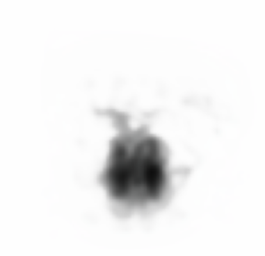
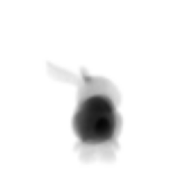
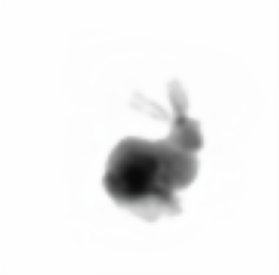
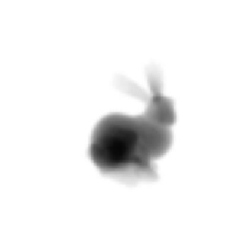
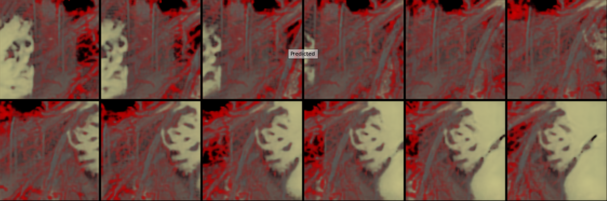
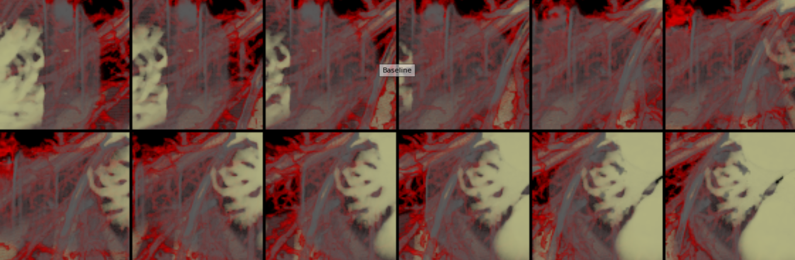

# Changelogs

## Sept 1st, 2021

* Clarified TODOs:
    * Write down overview and plans, see [Overview.md](Overview.md) [x]
    * Set up logs [x]
    * Check what attributes need to be included in each voxel of a volume [ ]

## Sept 4th, 2021

Finished the first milestone in [Overview](Overview.md):

* Test on easiest examples of density summation

  **Worst Example:**

  Prediction:

  

  Reference:

  

  **Best example:**

  Prediction:

  

  Reference:

  

  

* Test on examples of DVR

  Predictions:

  

  References:

  
  
  ## Sept 5th, 2021
  
  In the NanoVis meeting, some issues are pointed out:
  
  * Volumes are not large enough. 128^3 is just 2 million. Need to scale the model to 256^3 and see what happens. Maybe 512^3, since 3D convolutions and DVR in DeepDVR are volume-resolution-agnostic. [ ] 
  * Like in Sept 1st, check what attributes need to be included in each voxel of a volume [ ]
      * Decide what to do when multiple atoms partially occupy a voxel [ ]

